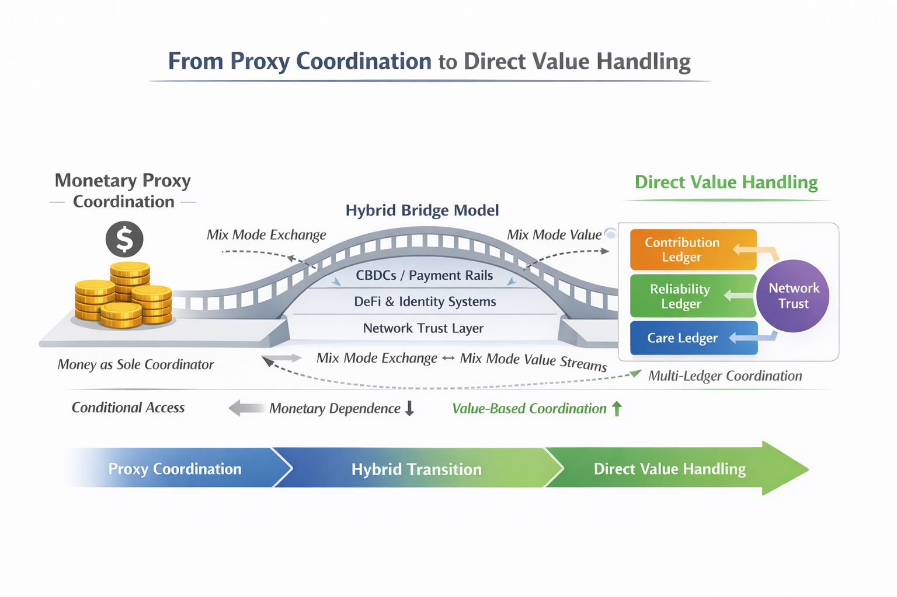

# Contribution–Access Network (CAN)
## Moving Beyond Money: From Proxy Coordination to Direct Value Handling

**Working Paper WP-004**  
**Status:** Conceptual & Structural Framework  
**Version:** 1.1 (Graphic Integrated)  
**Date:** 2026  

---

## Abstract

This working paper examines the structural transition from monetary proxy coordination toward direct value handling architectures. It argues that money emerged as a necessary abstraction under conditions of informational scarcity, but that digital networks, identity systems, and behavioural data infrastructures have removed many of the original constraints that made money indispensable.

The Contribution–Access Network (CAN) proposes a parallel coordination layer that separates contribution, reliability, care, and network trust into distinct but interoperable ledgers, enabling allocative mechanisms that are more adaptive to automation, demographic strain, and fiscal fragility.

---

## 1. Introduction: Why Money Was Necessary

Money solved a structural limitation. As societies expanded, individuals could no longer directly observe who contributed, who could be trusted, and who deserved access. Money compressed complex human behaviour into a single scalar metric that enabled coordination across scale, time, and distance.

Under informational scarcity, this abstraction was stabilising.

---

## 2. The Constraint Has Shifted

Digital infrastructure now enables:

- Persistent identity  
- Behavioural traceability  
- Distributed reputation  
- Network-based trust propagation  
- Real-time global coordination  

The informational scarcity that justified monetary abstraction has weakened significantly.

Yet our coordination architecture remains almost entirely monetary.

---

## 3. Conditional Existence

Modern economies tie access to essential resources to wage income and monetary stability.

CAN defines this as:

> Conditional existence through monetary mediation.

Automation intensifies this fragility by reducing wage dependency while maintaining monetary dependency.

---

## 4. CAN Architecture

CAN separates coordination into interoperable ledgers:

- Contribution Ledger  
- Reliability Ledger  
- Care Ledger  
- Network Trust Layer  

Instead of:

Money → Access  

CAN proposes:

Contribution + Reliability + Care (+ Network Trust) → Access  

Money may remain operational — but not exclusive.

---

## 5. The Hybrid Bridge Model

The transition away from exclusive monetary coordination is not binary.

It requires a hybrid phase in which both systems operate simultaneously.

---

## 6. Visual Architecture

---

### 6.1 Monetary Proxy Coordination (Left)

- Money as sole coordinator  
- Conditional access  
- Scalar abstraction  

---

### 6.2 Hybrid Bridge (Center)

Infrastructure:
- CBDCs / Payment Rails  
- DeFi & Identity Systems  
- Network Trust Layer  

This enables mixed-mode exchange:

Monetary Exchange + Direct Value Recognition operating simultaneously.

Monetary dependence decreases gradually while value-based coordination increases.

---

### 6.3 Direct Value Handling (Right)

- Multi-ledger coordination  
- Contribution-based recognition  
- Reliability scoring  
- Care inclusion  
- Network trust propagation  

Access becomes multi-dimensional rather than wage-dependent.

---

## 7. Mixed-Mode Coexistence

The core principle:

Monetary exchange and direct value handling must coexist during transition.

This avoids collapse while enabling structural evolution.

---

## 8. Conclusion

Money was necessary under informational scarcity.

In an era of informational abundance, coordination architectures can evolve.

CAN proposes a bridge — not disruption, not collapse — but deliberate structural transition toward resilient, dignity-preserving coordination.
